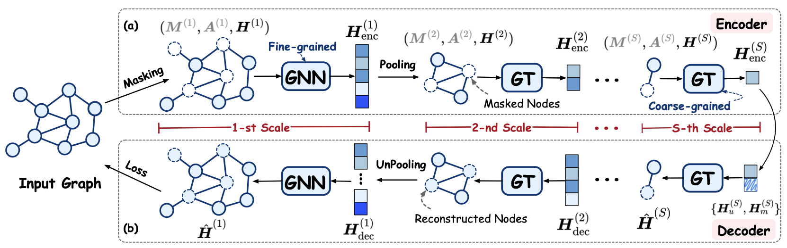

# Hi-GMAE: Hierarchical Graph Masked Autoencoders

## Overview



This paper presents **Hi-GMAE**, a novel multi-scale GMAE framework designed to handle the hierarchical structures within graphs.  Diverging from the standard graph neural network (GNN)used in GMAE models, Hi-GMAE modifies its encoder and decoder into hierarchical structures. This entails using GNN at the finer scales for detailed local graph analysis and employing a graph transformer at coarser scales to capture global information. 
### Python environment setup with Conda

```
conda create -n himae python=3.11
conda activate himae
conda install pytorch==2.1.0 torchvision==0.16.0 torchaudio==2.1.0 pytorch-cuda=11.8 -c pytorch -c nvidia
conda install pyg -c pyg
pip install ogb
pip install pygsp
pip install scipy
pip install tensorboardX
pip install matplotlib
pip install sortedcontainers
pip install pyg_lib torch_scatter torch_sparse torch_cluster torch_spline_conv -f https://data.pyg.org/whl/torch-2.1.0+cu118.html
```

### Running Hi-GMAE

Running unsupervised graph classification:

```
conda activate himae
# Running Hi-GMAE tuned hyperparameters for PROTEINS.
sh ./scripts/protein.sh 
# Running Hi-GMAE tuned hyperparameters for COLLAB.
sh ./scripts/collab.sh 
# Running Hi-GMAE tuned hyperparameters for D&D.
sh ./scripts/dd.sh 
```
Running transfer learning on molecular classification task:

```
conda activate himae
cd transfer_learning
# Pretraining Hi-GMAE on ZINC15.
python pretraining.py
# Finetuning Hi-GMAE on MoleculeNet datasets.
i.e. finetune on BACE
sh ./scripts/bace.sh
```

Supported datasets:

- TUDataset: `NCI1`, `PROTEINS`, `D&D`, `IMDB-BINARY`, `IMDB-MULTI`, `COLLAB`, `REDDIT-BINARY`
- MoleculeNet: `BBBP`, `Tox21`, `ToxCast`, `SIDER`, `ClinTox`, `MUV`, `HIV`, `BACE`,`Malaria` `CEP` 
- Quantum Machine: `QM7`,`QM8`,`QM9` 

### Baselines

- Infomax:https://github.com/snap-stanford/pretrain-gnns
- ContextPred:https://github.com/snap-stanford/pretrain-gnns                                            
- AttrMasking:https://github.com/snap-stanford/pretrain-gnns
- GCC:https://github.com/THUDM/GCC
- GraphCL:https://github.com/Shen-Lab/GraphCL
- SimGrace:https://github.com/junxia97/SimGRACE
- JOAO:https://github.com/Shen-Lab/GraphCL_Automated  
- GraphLoG:https://github.com/DeepGraphLearning/GraphLoG
- RGCL:https://github.com/lsh0520/rgcl
- S2GAE:https://github.com/qiaoyu-tan/S2GAE
- GraphMAE:https://github.com/THUDM/GraphMAE
- GraphMAE2:https://github.com/thudm/graphmae2
- Mole-BERT:https://github.com/junxia97/mole-bert
## Datasets

Unsupervised graph classification datasets mentioned above will be downloaded automatically using PyG's API when running the code. 

Dataset for molecular property prediction can be found [here](https://snap.stanford.edu/gnn-pretrain/data/chem_dataset.zip). After downloading, unzip it and put it in `transfer_learning/datasets`

Hi-GMAE is built using [PyG](https://www.pyg.org/) and [GraphMAE](https://github.com/THUDM/GraphMAE/tree/main). 

## Experimental Settings

#### Unsupervised Learning

**Parameter Settings.**  We use Adam optimizer with $\beta_1 = 0.9$, $\beta_2 = 0.999$, $\epsilon = 1e-8$. Additionally, we use PReLU as our nonlinear activation function. To minimize the introduction of excessive hyper-parameters, we choose to fix the hidden size as 512, coarsening method as JC, recovery epoch as one-quarter of the maximum epoch, and decay ratio as 1.0. For other hyper-parameter selections, we search the coarsening layer in the set $\{2, 3\}$, coarse ratio in the set $\{0.1, 0.2,..., 0.5\}$, and mask ratio in the set $\{0.1, 0.2,..., 0.6\}$.

**Training Details.**   For the pre-training, we use the same encoder type as GraphMAE in the fine-grained layer and GT in the coarse-grained layer. In terms of decoder selection, we also choose the same type of decoder as GraphMAE. At each level, we only utilize a single-layer decoder. For the evaluation, we use a LIBSVM as the classifier with hyper-parameter chosen from \{$10^{-3}, 10^{-2}, ..., 1, 10$​\}. We use 10-fold cross validation with 5 different seeds, reporting the average accuracy and variance across five random seeds as the evaluation metrics.

| Dataset        | PROTEINS |   D&D   |  NCI   | ENZYMES | Mutagencity | IMDB-B  | IMDB-M  | COLLAB  | RDT-B  |
| :------------- | :------: | :-----: | :----: | :-----: | :---------: | :-----: | :-----: | :-----: | :----: |
| Mask Ratio     |   0.6    |   0.3   |  0.25  |   0.3   |     0.5     |   0.3   |   0.3   |   0.5   |  0.6   |
| Encoder        |  GIN+GT  | GIN+GT  | GIN+GT | GIN+GT  |   GIN+GT    | GIN+GT  | GIN+GT  | GIN+GT  | GCN+GT |
| Decoder        |   GIN    |   GIN   |  GIN   |   GIN   |     GIN     |   GIN   |   GIN   |   GIN   |  GCN   |
| Num layers     |    3     |    1    |   3    |    2    |      3      |    1    |    1    |    1    |   2    |
| Learning Rate  | 0.00015  | 0.00015 | 0.0001 | 0.00015 |   0.00015   | 0.00015 | 0.00015 | 0.00015 | 0.006  |
| Batch size     |    32    |   32    |   16   |   32    |     32      |   32    |   32    |   32    |   8    |
| Pooling Layer  |    2     |    3    |   2    |    2    |      2      |    2    |    3    |    2    |   3    |
| Pooling Ratio  |   0.1    |   0.5   |  0.2   |   0.1   |     0.4     |   0.3   |  0.25   |   0.4   |  0.2   |
| Recovery Ratio |   0.8    |   0.2   |  0.5   |   0.0   |     0.0     |   0.0   |   0.0   |   0.0   |  0.7   |

#### Transfer Learning

**Parameter Settings.**  In transfer learning, the CoFi-R strategy is not applied due to the significant time consumption associated with parameter tuning. For the pre-training, we fix the coarsening layer at 2, mask ratio at 0.25, learning rate at 0.001, batch size at 256, and embedding size at 300. We search the coarsening ratio in the set $\{0.25, 0.5, 0.75\}$. For the fine-tuning, we fix the coarsening layer and learning rate the same as pre-training, and dropout ratio at 0.5. Besides, we search the coarsening ratio from 0.1 to 0.9, and batch size in $\{32, 64\}$. 

**Training Details.**  In transfer learning, we adopt a five-layer GIN as the encoder in the fine-grained layer and a single-layer GT in the coarse-grained layer. For the decoder selection, we employ a single GIN layer at each level. We pre-train the model for 100 epochs. For evaluation, the downstream datasets are split into 80/10/10% for train/validation/test using scaffold-split. We report ROC-AUC scores using ten different random seeds.

| Dataset      | BBBP | Tox21 | ToxCast | SIDER | ClinTox | MUV  | HIV  | BACE |
| ------------ | ---- | ----- | ------- | ----- | ------- | ---- | ---- | ---- |
| Batch size   | 32   | 32    | 32      | 32    | 32      | 32   | 32   | 32   |
| Pooling Rate | 0.8  | 0.8   | 0.8     | 0.4   | 0.1     | 0.6  | 0.5  | 0.9  |

